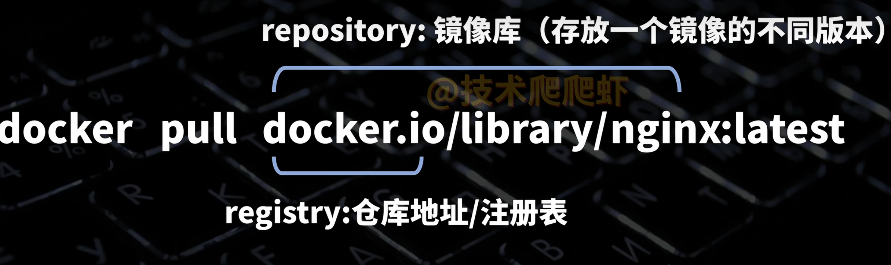
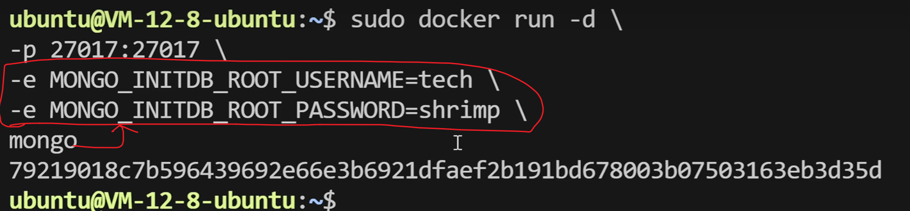
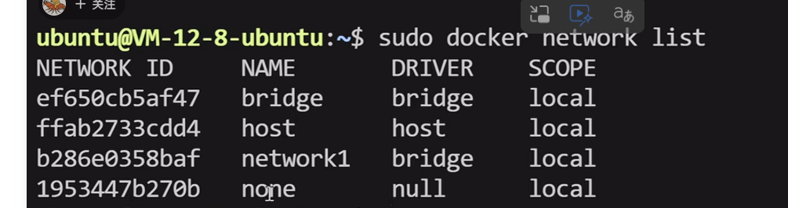
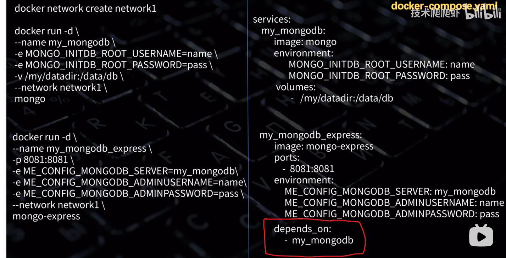
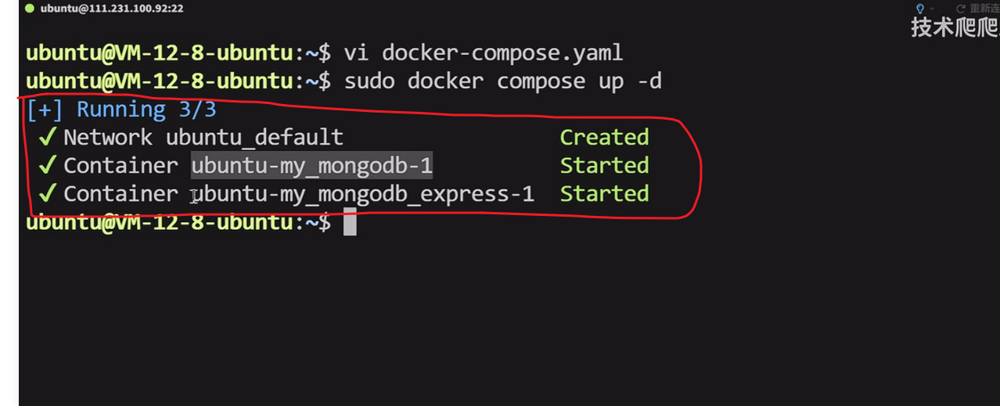
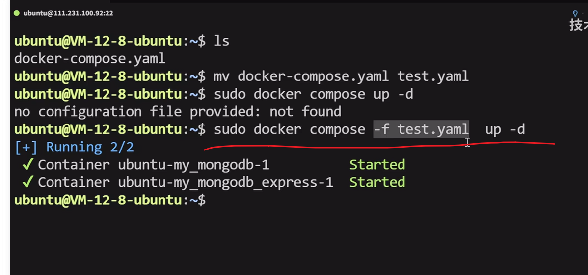

### docker命令

docker --version

docker pull docker.io/library/nginx:latest 

docker.io是docker官方仓库的注册表地址，可省略。library是命名空间，也就是作者，library就是官方提供者，可省略。nginx:latest  -> tag:version。version不写表示获取最新镜像。简化后的命令长这样：docker pull nginx

# docker.io是啥？docker.hub是啥

linux中报这个错：permission denied就是权限不够，没有在命令前面加sudo


sudo service docker restart


如果是因为网络问题导致的下载不成功，可以设置镜像站来解决

------



docker images 列举所有docker镜像

docker rmi  填写镜像id或镜像名 可以把对应镜像删除

docker rm 删除容器

### 运行容器

docker run 填镜像名字orID 使用镜像创建并运行容器

--rm：表示当容器停止的时候把它删掉

--restart：用来配置容器在停止时的重启策略。--restart always 只要容器停止就立即重启 --restart unless-stopped 手动停止的不会重启了，其他的会立即重启

-it：  可以让我的控制台进入容器进行交互

--name：给容器添加一个自定义的名字，容器内唯一，容器的名字和容器ID是等价使用的 

-d：让容器后台运行

--network 子网名 指定容器加入指定子网

-p：宿主机端口：容器内端口

-e：用来往容器里面传递环境变量



-v：宿主机目录：容器内目录 实现**挂载卷** 两个目录的内容同步了，改谁另一方都会跟着改。**但是初始加载，宿主机目录会覆盖容器内目录的内容。**  **直接把宿主机目录写在run命令里**，这种方式被称为**绑定挂载**。

还有一种方式实现挂载卷，命名卷挂载


####  挂载卷

docker volume create 挂载卷的名字 创建一个卷

**我们可以使用 docker volume inspect 卷名查看卷的信息，里面的MountPoint属性就是卷的宿主机真实目录在哪。命名卷还有一个功能就是，在绑定的时候，会把容器目录的内容同步到命名卷里面实现初始化**，想去查看这个真是目录的话，可能需要切换成root用户，**sudo -i**。

docker volume list 列出所有创建的卷

docker volume rm 可以删除一个卷

docker volume prune -a 删除所有没有任何容器使用的卷

docker ps 查看所有运行的容器状态

-a：加了这个，就可以查看所有docker容器的状态了

docker stop 容器名字或ID 暂停容器的运行

docker start 容器名字或ID 重启容器

docker inspect 容器名字或ID 查看容器的详细信息  （tips：可以把信息丢给ai，想知道什么信息就问ai）

docker create 是创建容器但不启动

 docker logs 容器名字或ID 可以查看容器的日志


docker 容器内部就像一个独立的操作系统，每个容器都是一个独立的运行环境 

docker exec  容器ID linux命令   可以在容器内部执行linux命令，但是还是在宿主机的控制台里

docker exec -it 容器ID /bin/sh 可以进入一个docker容器内部，获得一个交互式的命令行环境

​	但是docker容器内部是一个压缩的操作系统，很多系统工具是缺失的，需要我们手动下载。在容器内工具安装之前需要执行 cat /etc/os-release 查一下容器内的linux是什么发行版的，然后使用不同的管理员命令（apt / sudo）


### Dockerfile

是一个文件，里面详细列出了镜像是如何制作的 。D要大写，并且没有后缀。

#### 创建Dockerfile

第一行都是 from 基础镜像

WORKDIR 镜像内目录  进入到镜像中的某个目录，作为工作目录，后面的命令都是在这个目录下执行的

COPY .. 使用把我们的代码拷贝到工作目录 第一个。代表我这台电脑的当前目录 第二个。代表镜像内的目录，也就是工作目录

接下来安装依赖 RUN pip install -r requirement.txt 表示这个命令要在镜像里面执行

EXPOSE 8000 表示镜像提供服务的端口是哪个 不说明也没关系 实际使用的时候还是要以-p参数为准

接下来最后一行 CMD ["python3", "main.py"] **CMD是容器运行时的默认启动命令，也就是每当容器启动时，容器内部都会自动执行这个命令**  这个命令的意思就是使得容器内有一个python程序在运行。**命令最好写成数组的形式，中间最好不要用空格 一个Dockerfile里面只能写一个CMD**

跟CMD类似的是ENTRYPOINT，他的优先级更高，不容易被覆盖。

Dockerfile写好以后，就可以创建镜像了

在当前目录执行docker build -t docker_test .         -t可以给docker镜像起一个名字，名字后面可以加 :version 最后的。表示是在当前文件夹构建 

#### 例子

```dockerfile
from python:3.13-slim

WORKDIR /app

COPY . .

RUN pip install -r requirement.txt

EXPOSE 8000

CMD ["python3",  "main.py"]
```


#### 推送镜像到docker hub上

在本地终端执行 docker login，之后系统会提示一个英文验证码和一个网站，我们需要打开这个网站把验证码填写过来，回到命令行显示login succeed就成功了。 我们在推送镜像的时候，必须在前面带上我们的用户名，也就是我们在docker hub官网上注册的账号的用户名


docker login

docker build -t kanm7/docker_test .   本地创建镜像可以不用加命名空间，但是如果要推送到docker hub上就要加了

docker push kanm7/docker_test

#### docker网络

docker network list 展示出所有网络



docker network rm 自定义网络

##### 桥接模式

docker网络默认是bridge，所有的容器默认连接到这个网络，每个容器都分配了一个内部IP地址，一般是172.17开头的，在内部子网类里面，容器可以通过内部IP地址互相访问，但是容器网络和宿主机网络是隔离的 

docker network create network1  创建一个子网 然后可以指定容器加入不同的子网，同一个子网的容器可以相互通信，跨子网不可以，并且，同一个子网的容器可以使用容器的名字相互访问，不用非得用内部ip地址

我们可以在进入到某一个容器A内部，使用ping 容器名B，如果A、B在同一个子网，就可以查看B的子网ip了

##### host模式

docker容器直接共享宿主机的网络，容器直接使用宿主机的ip地址，而且无需-p参数进行端口映射，容器内的服务直接运行在宿主机的端口上，通过宿主机的ip和端口就能访问到容器

使用host模式就是在run容器的时候，加上参数 --network host 就可以

在容器内部查看ip地址，需要装一下工具

apt update

apt install iproute2 

ip addr show

##### none模式

也就是不联网

#### docker compose

docker compose使用yml文件管理多个容器，里面列出了容器之间是如何创建，以及如何协同工作的，我们可以简单的把docker compose文件理解成一个或多个Docker run命令，按照特定的格式列到了一个文件里面

右侧最顶级的是services元素，每个服务也就是一个service都对应一个容器，左侧的--name也就是容器名，在右侧就变成了service名，左侧最后的镜像名，在右侧写在了image后面也表示镜像名，左边的-e参数对应右边的environments，都是环境变量的意思，左侧的-v对应右侧的volumes，也就是挂载卷，左侧的-p对应右边的ports，也就是端口映射，左右两边唯一的区别就是，左边定义了一个子网network1，而右边没有，因为docker会为每一个compose文件都自动创建一个子网，同一个compose里面定义的所有容器，都会自动加入同一个子网。



docker compose还有一个额外功能：可以自定义容器的启动顺序，比如上面的depents_on 

我们只需要把我们想要执行的docker命令发给ai，让ai写对应的docker compose文件就可以了

在命令行：

docker compose up 启动文件里面定义的所有容器  重复执行没用

-d：在后台运行



但是这两个容器跟我们在service中定义的名字不同，在前面加了一个前缀，在后面加了一个编号

docker compose down 这个命令会停止并且删除容器

docker compose stop 只停止不删除

docker compose start 把停止的命令启动起来 

我们在执行docker compose命令时，它会自动识别当前目录下的严格叫做docker-compose.yaml这个文件，如果改了这个文件名，再使用docker compose命令就找不到了。对于这种非标准的文件名，我们可以在docker compose后面加 -f 也就是指定文件名，就可以识别文件了

